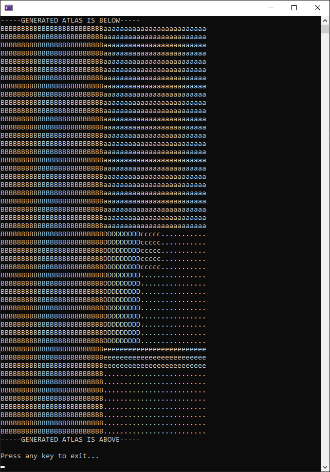
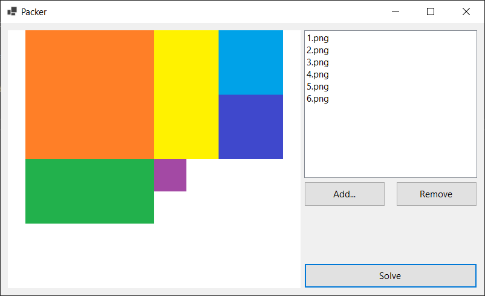

# rectangle-bin-packer-core

`Rectangle Bin Packer Core` is an improved version of the [`Greedy Rectangle Bin Packer`](https://github.com/kernja/Greedy-Rectangle-Bin-Packer) that was originally written in VB.Net and .Net Framework 4.5.

Rewritten in C# and .Net Core 3.1, `Rectangle Bin Packer Core` utilizes dependency injection with a service-oriented architecture to pack objects into a two-dimensional atlas. The utilization of interfaces and generic types means that the algorithm can be utilized outside of image processing, and custom validators can be utilized to restrict algorithm output.

## Solution

*Note: This project is currently being worked on, so please expect changes to occur!* 

* consoleApp
    * `RectBinPacker.ConsoleApp`
        * Runs the algorithm with text-based models and displays output to the console.
    * `RectBinPacker.ConsoleApp.Models`
        * Models exclusively utilized by the `RectBinPacker.ConsoleApp`
    * `RectBinPacker.ConsoleApp.Models`
        * Services exclusively utilized by the `RectBinPacker.ConsoleApp`
* desktopApp
    * `RectBinPacker.DesktopApp`
        * Runs the algorithm with image-based models within a WinForms app, and displays the output to a picture box.
    * `RectBinPacker.DesktopApp.Adapters`
        * Model conversion adapters exclusively utilized by the `RectBinPacker.DesktopApp`
    * `RectBinPacker.DesktopApp.Models`
        * Models exclusively utilized by the `RectBinPacker.DesktopApp`
    * `RectBinPacker.DesktopApp.Services`
        * Services exclusively utilized by the `RectBinPacker.DesktopApp`
* libraries
    * `RectBinPacker.Interfaces`
        * Defines interfaces for the bin packer solver service and child objects.
    * `RectBinPacker.Services.Solver`
        * Implementation of the packing algorithm as a service.
    * `RectBinPacker.Validators`
        * Validators utilized to set boundaries on the packing algorithm.
* tests
    * `RectBinPacker.Tests.Integration`
        * Work TBD. Currently nothing.
    * `RectBinPacker.Tests.Unit`
        * Currently has tests for `RectBinPacker.Validators`     

## Sample Assets

The repo includes six sample pictures that can be utilized for test data.

## Libraries and Frameworks

* C# and .Net Core 3.1
* System.Linq
* Microsoft.Net.Test.sdk
* Microsoft.Extensions.DependencyInjection
* Microsoft.Extensions.Logging
* System.Drawing.Common
* Moq
* Xunit
* Xunit.runner.visualstudio
